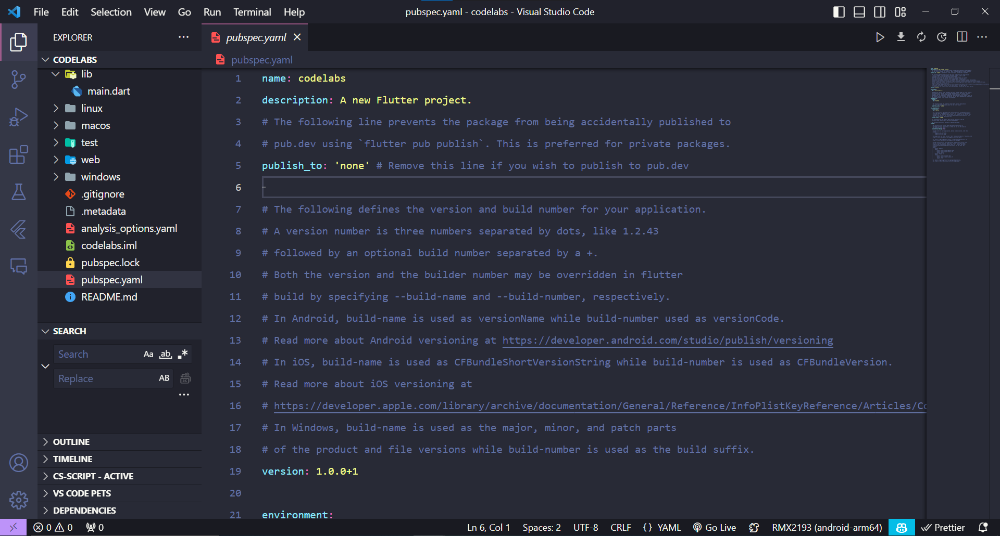
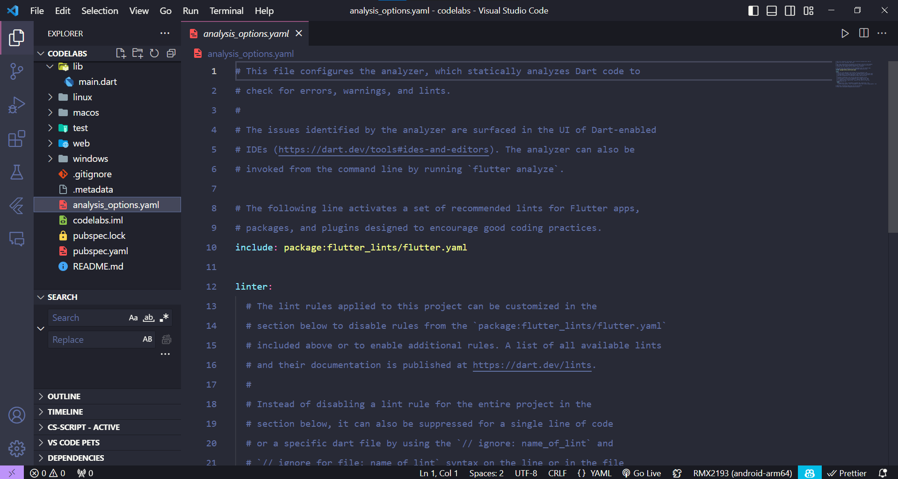
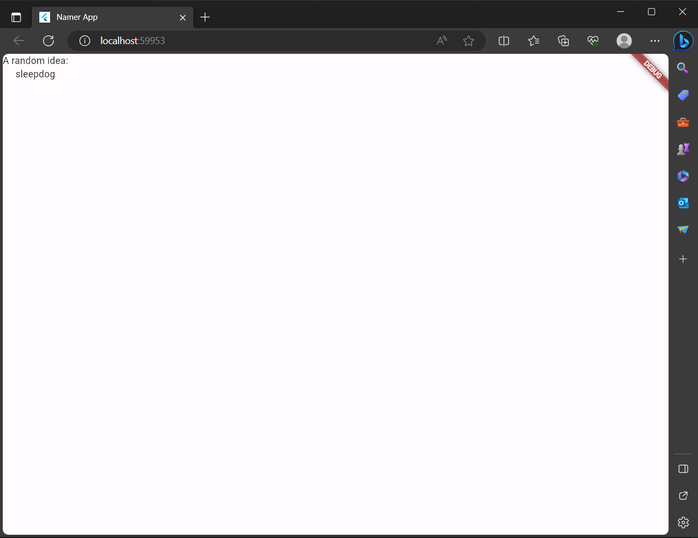

# Tugas 3

Selesaikan [Codelabs: Your first Flutter app](https://codelabs.developers.google.com/codelabs/flutter-codelab-first#0), lalu buatlah laporan praktikumnya dan push ke repository GitHub Anda!

## Create a project

### Create your first Flutter project

Launch Visual Studio Code and open the command palette (with F1 or Ctrl+Shift+P or Shift+Cmd+P). Start typing "flutter new". Select the Flutter: New Project command.

Next, select Application and then a folder in which to create your project. This could be your home directory, or something like C:\src\.

Finally, name your project. Something like namer_app or my_awesome_namer.

Flutter now creates your project folder and VS Code opens it.

You'll now overwrite the contents of 3 files with a basic scaffold of the app.

### Copy & Paste the initial app

In the left pane of VS Code, make sure that Explorer is selected, and open the pubspec.yaml file.



replece its content with the following

```yaml
name: codelabs
description: A new Flutter project.

publish_to: "none" # Remove this line if you wish to publish to pub.dev

version: 0.0.1+1

environment:
  sdk: ">=2.19.4 <4.0.0"

dependencies:
  flutter:
    sdk: flutter

  english_words: ^4.0.0
  provider: ^6.0.0

dev_dependencies:
  flutter_test:
    sdk: flutter

  flutter_lints: ^2.0.0

flutter:
  uses-material-design: true
```

Next, open another configuration file in the project, analysis_options.yaml.



Replace its contents with the following:

analysis_options.yaml

````yaml
include: package:flutter_lints/flutter.yaml
linter:
  rules:
    prefer_const_constructors: false
    prefer_final_fields: false
    use_key_in_widget_constructors: false
    prefer_const_literals_to_create_immutables: false
    prefer_const_constructors_in_immutables: false
    avoid_print: false```
````

This file determines how strict Flutter should be when analyzing your code. Since this is your first foray into Flutter, you're telling the analyzer to take it easy. You can always tune this later. In fact, as you get closer to publishing an actual production app, you will almost certainly want to make the analyzer stricter than this.

Finally, open the main.dart file under the lib/ directory.

Replace the contents of this file with the following:

lib/main.dart

```dart
import 'package:english_words/english_words.dart';
import 'package:flutter/material.dart';
import 'package:provider/provider.dart';

void main() {
  runApp(MyApp());
}

class MyApp extends StatelessWidget {
  const MyApp({super.key});

  @override
  Widget build(BuildContext context) {
    return ChangeNotifierProvider(
      create: (context) => MyAppState(),
      child: MaterialApp(
        title: 'Namer App',
        theme: ThemeData(
          useMaterial3: true,
          colorScheme: ColorScheme.fromSeed(seedColor: Colors.deepOrange),
        ),
        home: MyHomePage(),
      ),
    );
  }
}

class MyAppState extends ChangeNotifier {
  var current = WordPair.random();
}

class MyHomePage extends StatelessWidget {
  @override
  Widget build(BuildContext context) {
    var appState = context.watch<MyAppState>();

    return Scaffold(
      body: Column(
        children: [
          Text('A random idea:'),
          Text(appState.current.asLowerCase),
        ],
      ),
    );
  }
}
```

These 50 lines of code are the entirety of the app so far.

In the next section, run the application in debug mode and start developing.

## Add a button

This step adds a Next button to generate a new word pairing.

### Launch the app

First, open lib/main.dart and make sure that you have your target device selected. At the bottom right corner of VS Code, you'll find a button that shows the current target device. Click to change it.

While lib/main.dart is open, find the "play" fdc6c5dfe6ef7882.png button in the upper right-hand corner of VS Code's window, and click it.

After about a minute, your app launches in debug mode. It doesn't look like much yet:



### First Hot Reload

At the bottom of lib/main.dart, add something to the string in the first Text object, and save the file (with Ctrl+S or Cmd+S). For example:

```dart
return Scaffold(
      body: Column(
        children: [
          Text('A random AWESOME idea:'),  // ← Example change.
          Text(appState.current.asLowerCase),
        ],
      ),
    );
```


### Adding a button

Next, add a button at the bottom of the Column, right below the second Text instance.

```dart

  return Scaffold(
      body: Column(
        children: [
          Text('A random AWESOME idea:'),
          Text(appState.current.asLowerCase),

          // ↓ Add this.
          ElevatedButton(
            onPressed: () {
              print('button pressed!');
            },
            child: Text('Next'),
          ),

        ],
      ),
    );
```
