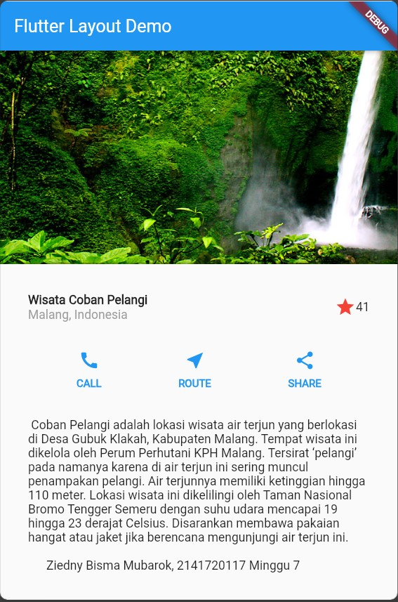

# Layout dan Navigasi

## Praktikum 1

### Langkah 2

**code:**

```dart
import 'package:flutter/material.dart';

void main() => runApp(const MyApp());

class MyApp extends StatelessWidget {
  const MyApp({super.key});

  @override
  Widget build(BuildContext context) {
    return MaterialApp(
      title: 'Flutter layout: Ziedny Bisma Mubarok, 2141720117',
      home: Scaffold(
        appBar: AppBar(
          title: const Text('Flutter layout demo'),
        ),
        body: const Center(
          child: Text('Hello World'),
        ),
      ),
    );
  }
}
```

### Langkah 4

membuat titleSection, dengan soal 1,2, dan 3

**full code:**

```dart
  Widget titleSection = Container(
    padding: const EdgeInsets.all(32),
    child: Row(
      children: [
        Expanded(
          // Soal 1
          child: Column(
            crossAxisAlignment: CrossAxisAlignment.start,
            children: [
              // soal 2
              Container(
                padding: const EdgeInsets.only(bottom: 1.0),
                child: const Text(
                  'Wisata di Gunung Batu',
                  style: TextStyle(
                    fontWeight: FontWeight.bold,
                  ),
                ),
              ),
              const Text(
                'Batu, Malang, Indonesia',
                style: TextStyle(color: Colors.grey),
              )
            ],
          ),
        ),
        //soal 3
        const Icon(
          Icons.star,
          color: Colors.red,
        ),
        const Text("41"),
      ],
    ),
  );

```

**memanggil:**

```dart
 Widget build(BuildContext context) {
    return MaterialApp(
      title: 'Flutter Layout: Ziedny Bisma Mubarok, 2141720117',
      home: Scaffold(
          appBar: AppBar(
            title: const Text('Flutter Layout Demo'),
          ),
          body: Column(
            children: [
              titleSection,
            ],
          )),
    );
  }
```

**Hasil**


## Praktikum 2: Implementasi button row

### Langkah 1: Buat method Column \_buildButtonColumn

**code**

```dart
Column _buildButtonColumn(Color color, IconData icon, String label) {
    return Column(
      mainAxisSize: MainAxisSize.min,
      mainAxisAlignment: MainAxisAlignment.center,
      children: [
        Icon(icon, color: color),
        Container(
          margin: const EdgeInsets.only(top: 8),
          child: Text(
            label,
            style: TextStyle(
              fontSize: 12,
              fontWeight: FontWeight.w800,
              color: color,
            ),
          ),
        )
      ],
    );
  }
```

### Langkah 2: Buat widget buttonSection

**Code:**

```dart
Color color = Theme.of(context).primaryColor;

    Widget buttonSection = Row(
      mainAxisAlignment: MainAxisAlignment.spaceEvenly,
      children: [
        _buildButtonColumn(color, Icons.call, 'CALL'),
        _buildButtonColumn(color, Icons.near_me, 'ROUTE'),
        _buildButtonColumn(color, Icons.share, 'SHARE'),
      ],
    );

```

### Langkah 3: Tambah button section ke body

```dart

    return MaterialApp(
      title: 'Flutter Layout: Ziedny Bisma Mubarok, 2141720117',
      home: Scaffold(
          appBar: AppBar(
            title: const Text('Flutter Layout Demo'),
          ),
          body: Column(
            children: [
              titleSection,
              buttonSection,
            ],
          )),
    );
```

**Hasil**


## Praktikum 3: Implementasi text section

### Langkah 1: Buat class VerificationCodeInput

```dart
Widget textSection = Container(
   padding: const EdgeInsets.all(32),
    child: const Text(
      """ Coban Pelangi adalah lokasi wisata air terjun yang berlokasi di Desa Gubuk Klakah, Kabupaten Malang. Tempat wisata ini dikelola oleh Perum Perhutani KPH Malang. Tersirat ‘pelangi’ pada namanya karena di air terjun ini sering muncul penampakan pelangi. Air terjunnya memiliki ketinggian hingga 110 meter. Lokasi wisata ini dikelilingi oleh Taman Nasional Bromo Tengger Semeru dengan suhu udara mencapai 19 hingga 23 derajat Celsius. Disarankan membawa pakaian hangat atau jaket jika berencana mengunjungi air terjun ini.

      """
      'Ziedny Bisma Mubarok, 2141720117 '
      'Minggu 7 ',
      softWrap: true,
    ),
);
```

### Langkah 2: Tambahkan variabel text section ke body

**code**

```dart
return MaterialApp(
      title: 'Flutter Layout: Ziedny Bisma Mubarok, 2141720117',
      home: Scaffold(
          appBar: AppBar(
            title: const Text('Flutter Layout Demo'),
          ),
          body: SingleChildScrollView(
            child: Column(
              children: [
                Image.network('/assets/images/coban-pelangi.jpg'),
                titleSection,
                buttonSection,
                textSection,
              ],
            ),
          )),
    );
```

**Jawaban**


## Praktikum 4: Implementasi image section

### Langkah 1: Siapkan aset gambar

```yaml
flutter:
  uses-material-design: true

  assets:
    - assets/images/
```

### Langkah 2: Tambahkan gambar ke body

```dart
return MaterialApp(
      title: 'Flutter Layout: Ziedny Bisma Mubarok, 2141720117',
      home: Scaffold(
        appBar: AppBar(
          title: const Text('Flutter Layout Demo'),
        ),
        body: SingleChildScrollView(
          child: Column(
            children: [
              Image.network(
                '/assets/images/coban-pelangi.jpg',
                width: 600,
                height: 400,
                fit: BoxFit.cover,
              ),
              titleSection,
              buttonSection,
              textSection,
            ],
          ),
        ),
      ),
    );

```

### Langkah 3: Terakhir, ubah menjadi ListView

```dart
return MaterialApp(
      title: 'Flutter Layout: Ziedny Bisma Mubarok, 2141720117',
      home: Scaffold(
        appBar: AppBar(
          title: const Text('Flutter Layout Demo'),
        ),
        body: ListView(
          children: [
            Image.network(
              '/assets/images/coban-pelangi.jpg',
              width: 600,
              height: 400,
              fit: BoxFit.cover,
            ),
            titleSection,
            buttonSection,
            textSection,
          ],
        ),
      ),
    );
```

**Hasil**


