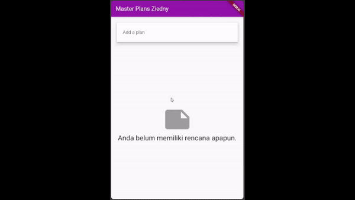

# Praktikum 1: Dasar State dengan Model-View

## Langkah 1: Buat Project Baru

Struktur folder:


## Langkah 2: Membuat model task.dart

models/task.dart:

```dart
class Task {
  final String description;
  final bool complete;

  const Task({this.description = '', this.complete = false});
}
```

## Langkah 3: Buat file plan.dart

models/plan.dart:

```dart
import 'task.dart';

class Plan {
  final String name;
  final List<Task> tasks;

  const Plan({this.name = '', this.tasks = const []});
}
```

## Langkah 4: Buat file data_layer.dart

```dart
export 'plan.dart';
export 'task.dart';
```

## Langkah 5: Pindah ke file main.dart

main.dart:

```dart
import 'package:flutter/material.dart';

import './views/plan_screen.dart';

void main() => runApp(const MasterPlanApp());

class MasterPlanApp extends StatelessWidget {
  const MasterPlanApp({super.key});

  @override
  Widget build(BuildContext context) {
    return MaterialApp(
      theme: ThemeData(primarySwatch: Colors.purple),
      home: const PlanScreen(),
    );
  }
}
```

## Langkah 6 sampai 13 plan_screen.dart 

views/plan_screen.dart

```dart
import 'package:flutter/material.dart';

import '../models/data_layer.dart';

class PlanScreen extends StatefulWidget {
  const PlanScreen({super.key});

  @override
  State<PlanScreen> createState() => _PlanScreenState();
}

class _PlanScreenState extends State<PlanScreen> {
  Plan plan = const Plan();
  late ScrollController scrollController;

  @override
  void dispose() {
    scrollController.dispose();
    super.dispose();
  }

  @override
  void initState() {
    super.initState();
    scrollController = ScrollController()
      ..addListener(() {
        FocusScope.of(context).requestFocus(FocusNode());
      });
  }

  @override
  Widget build(BuildContext context) {
    return Scaffold(
      appBar: AppBar(
        title: const Text('Master Plan Ziedny'),
      ),
      body: _buildList(),
      floatingActionButton: _buildAddTextButton(),
    );
  }

  Widget _buildTextTile(Task task, int index) {
    return ListTile(
      leading: Checkbox(
          value: task.complete,
          onChanged: (selected) {
            setState(() {
              plan = Plan(
                name: plan.name,
                tasks: List<Task>.from(plan.tasks)
                  ..[index] = Task(
                    description: task.description,
                    complete: selected ?? false,
                  ),
              );
            });
          }),
      title: TextFormField(
        initialValue: task.description,
        onChanged: (text) {
          setState(() {
            plan = Plan(
              name: plan.name,
              tasks: List<Task>.from(plan.tasks)
                ..[index] = Task(
                  complete: task.complete,
                  description: text,
                ),
            );
          });
        },
      ),
    );
  }

  Widget _buildList() {
    return ListView.builder(
      controller: scrollController,
      itemCount: plan.tasks.length,
      itemBuilder: (context, index) => _buildTextTile(plan.tasks[index], index),
      keyboardDismissBehavior: Theme.of(context).platform == TargetPlatform.iOS
          ? ScrollViewKeyboardDismissBehavior.onDrag
          : ScrollViewKeyboardDismissBehavior.manual,
    );
  }

  Widget _buildAddTextButton() {
    return FloatingActionButton(
        child: const Icon(Icons.add),
        onPressed: () {
          setState(() {
            plan = Plan(
              name: plan.name,
              tasks: List<Task>.from(plan.tasks)..add(const Task()),
            );
          });
        });
  }
}
```

## Langkah 14: Hasil


# Tugas Praktikum 1: Dasar State dengan Model-View

1. Selesaikan langkah-langkah praktikum tersebut, lalu dokumentasikan berupa GIF hasil akhir praktikum beserta penjelasannya di file README.md! Jika Anda menemukan ada yang error atau tidak berjalan dengan baik, silakan diperbaiki.
   
   **Jawaban**

    Error terjadi karena baris kode yang ditujuk tidak ditemukan, misal ketika mengerjakan `main.dart`, menggunakan `PlanScreen()` yang belum dibuat. Namun diluar itu, tidak  ditemukan error dan berjalan dengan baik.
   
2. Jelaskan maksud dari langkah 4 pada praktikum tersebut! Mengapa dilakukan demikian?
   
    **Jawaban**

    Kode tersebut digunakan untuk membuat dua file, plan.dart dan task.dart, dapat diakses secara publik dalam modul atau paket saat ini. Artinya, siapa pun yang mengimpor modul atau paket saat ini akan dapat menggunakan konten dari dua file tersebut secara langsung tanpa harus mengimpornya secara eksplisit.

3. Mengapa perlu variabel plan di langkah 6 pada praktikum tersebut? Mengapa dibuat konstanta ?

    **Jawaban**

    `const Plan()` digunakan sebagai efisiensi memori, dan ini digunakan karena `const Plan()` hanya digunakan untuk value awal yang nantinya dapat diubah.

4. Lakukan capture hasil dari Langkah 9 berupa GIF, kemudian jelaskan apa yang telah Anda buat!

    **Jawaban**

    membuat aplikasi duntuk list rencana dimana kita bisa menambah list kemudian mengisi text dan mencentang list

   

   

5. Apa kegunaan method pada Langkah 11 dan 13 dalam lifecyle state ?

    **Jawaban**

    - Metode `initState()` dipanggil saat widget pertama kali dibuat. Metode ini dapat digunakan untuk melakukan inisialisasi widget, seperti menginisialisasi variabel atau mengatur nilai properti. Ini membuat scroll controller baru dan menambahkan event listener ke dalamnya. Event Listener dipanggil setiap kali posisi scroll scroll controller berubah. Saat event listener dipanggil, akan diminta fokus untuk node fokus baru.
  
    - Metode `dispose()` dipanggil saat widget dihancurkan. Metode ini dapat digunakan untuk membebaskan sumber daya yang digunakan oleh widget, seperti menutup koneksi jaringan atau melepaskan memori. Kode ini membuang  scroll controller. Hal ini penting dilakukan karena akan mengosongkan sumber daya yang digunakan oleh  scroll controller.

6. Kumpulkan laporan praktikum Anda berupa link commit atau repository GitHub ke spreadsheet yang telah disediakan!

# Praktikum 2: Mengelola Data Layer dengan InheritedWidget dan InheritedNotifier

## Langkah 1: Buat file plan_provider.dart

provider/plan_provider.dart:

```dart
import 'package:flutter/material.dart';
import 'package:master_plan/models/data_layer.dart';

class PlanProvider extends InheritedNotifier<ValueNotifier<Plan>> {
  const PlanProvider(
      {super.key, required Widget child, required ValueNotifier<Plan> notifier})
      : super(child: child, notifier: notifier);
  static ValueNotifier<Plan> of(BuildContext context) {
    return context
        .dependOnInheritedWidgetOfExactType<PlanProvider>()!
        .notifier!;
  }
}

```

## Langkah 2: Edit main.dart

main.dart:

```dart
import 'package:flutter/material.dart';
import 'package:master_plan/models/data_layer.dart';
import 'package:master_plan/provider/plan_provider.dart';

import './views/plan_screen.dart';

void main() => runApp(const MasterPlanApp());

class MasterPlanApp extends StatelessWidget {
  const MasterPlanApp({super.key});

  @override
  Widget build(BuildContext context) {
    return MaterialApp(
        theme: ThemeData(primarySwatch: Colors.purple),
        home: PlanProvider(
          notifier: ValueNotifier<Plan>(
            const Plan(),
          ),
          child: const PlanScreen(),
        ));
  }
}

```

## Langkah 3: Tambah method pada model plan.dart

models/plan.dart

```dart
import 'task.dart';

class Plan {
  final String name;
  final List<Task> tasks;

  const Plan({this.name = '', this.tasks = const []});

  int get completedCount => tasks.where((task) => task.complete).length;
  String get completenessMessage =>
      '$completedCount out of ${tasks.length} tasks';
}

```

## Langkah 4: Pindah ke PlanScreen

Edit PlanScreen agar menggunakan data dari PlanProvider. Hapus deklarasi variabel plan (ini akan membuat error). Kita akan perbaiki pada langkah 5 berikut ini.

## Langkah 5: Edit method _buildAddTaskButton

views/plan_provider.dart:

```dart
  Widget _buildAddTextButton(BuildContext context) {
    ValueNotifier<Plan> planNotifier = PlanProvider.of(context);
    return FloatingActionButton(
        child: const Icon(Icons.add),
        onPressed: () {
          Plan currentPlan = planNotifier.value;
          planNotifier.value = Plan(
            name: currentPlan.name,
            tasks: List<Task>.from(currentPlan.tasks)..add(const Task()),
          );
        });
  } 
```

## Langkah 6: Edit method _buildTaskTile

views/plan_provider.dart:

```dart
  Widget _buildTextTile(Task task, int index, BuildContext context) {
    ValueNotifier<Plan> planNotifier = PlanProvider.of(context);
    return ListTile(
      leading: Checkbox(
          value: task.complete,
          onChanged: (selected) {
            Plan currentPlan = planNotifier.value;
            planNotifier.value = Plan(
              name: currentPlan.name,
              tasks: List<Task>.from(currentPlan.tasks)
                ..[index] = Task(
                  description: task.description,
                  complete: selected ?? false,
                ),
            );
          }),
      title: TextFormField(
        initialValue: task.description,
        onChanged: (text) {
          Plan currentPlan = planNotifier.value;
          planNotifier.value = Plan(
            name: currentPlan.name,
            tasks: List<Task>.from(currentPlan.tasks)
              ..[index] = Task(
                description: text,
                complete: task.complete,
              ),
          );
        },
      ),
    );
  }

```

## Langkah 7: Edit _buildList

views/plan_provider.dart:

```dart
  Widget _buildList(Plan plan) {
    return ListView.builder(
      controller: scrollController,
      itemCount: plan.tasks.length,
      itemBuilder: (context, index) =>
          _buildTextTile(plan.tasks[index], index, context),
      keyboardDismissBehavior: Theme.of(context).platform == TargetPlatform.iOS
          ? ScrollViewKeyboardDismissBehavior.onDrag
          : ScrollViewKeyboardDismissBehavior.manual,
    );
  }
```

## Langkah 8: Tetap di class PlanScreen

Edit method build sehingga bisa tampil progress pada bagian bawah (footer). Caranya, bungkus (wrap) _buildList dengan widget Expanded dan masukkan ke dalam widget Column seperti kode pada Langkah 9.

## Langkah 9: Tambah widget SafeArea

views/plan_provider.dart:

```dart

  @override
  Widget build(BuildContext context) {
    return Scaffold(
      appBar: AppBar(
        title: const Text('Master Plan Ziedny'),
      ),
      body: ValueListenableBuilder<Plan>(
        valueListenable: PlanProvider.of(context),
        builder: (context, plan, child) {
          return Column(
            children: [
              Expanded(child: _buildList(plan)),
              SafeArea(child: Text(plan.completenessMessage))
            ],
          );
        },
      ),
      floatingActionButton: _buildAddTextButton(context),
    );
  }

```


# Tugas Praktikum 2: InheritedWidget

1. Selesaikan langkah-langkah praktikum tersebut, lalu dokumentasikan berupa GIF hasil akhir praktikum beserta penjelasannya di file README.md! Jika Anda menemukan ada yang error atau tidak berjalan dengan baik, silakan diperbaiki sesuai dengan tujuan aplikasi tersebut dibuat.

2. Jelaskan mana yang dimaksud InheritedWidget pada langkah 1 tersebut! Mengapa yang digunakan InheritedNotifier?
   
   **Jawaban**

  InheritedWidget dan InheritedNotifier adalah widget Flutter yang memungkinkan berbagi data antar widget.

3. Jelaskan maksud dari method di langkah 3 pada praktikum tersebut! Mengapa dilakukan demikian?

  **Jawaban**

  Langkah 3 memberikan jumlah dari task yang sudah terselesaikan

4. Lakukan capture hasil dari Langkah 9 berupa GIF, kemudian jelaskan apa yang telah Anda buat!

kurang lebih  sama namun data sudah tersimpan dalam provider


1. Kumpulkan laporan praktikum Anda berupa link commit atau repository GitHub ke spreadsheet yang telah disediakan!


# Tugas Praktikum 3: State di Multiple Screens

1. Selesaikan langkah-langkah praktikum tersebut, lalu dokumentasikan berupa GIF hasil akhir praktikum beserta penjelasannya di file README.md! Jika Anda menemukan ada yang error atau tidak berjalan dengan baik, silakan diperbaiki sesuai dengan tujuan aplikasi tersebut dibuat.
   
2. Berdasarkan Praktikum 3 yang telah Anda lakukan, jelaskan maksud dari gambar diagram berikut ini!

  **Jawab**

  Ketika rute berpindah dari `PlanCreatorScreen` menuju `PlanScreen`  variable plan akan digunakan sebagai parameter, kemudian plan ini akan menjadi variable yang digunakan untuk memunculkan list pada halaman `PlanScreen` 

3. Lakukan capture hasil dari Langkah 14 berupa GIF, kemudian jelaskan apa yang telah Anda buat!
   
   **Jawab**
   

  kini karena value variable sudah tersimpan pada provider, kita dapat menggunakannya dari screen lain pada aplikasi
  

4. Kumpulkan laporan praktikum Anda berupa link commit atau repository GitHub ke spreadsheet yang telah disediakan!