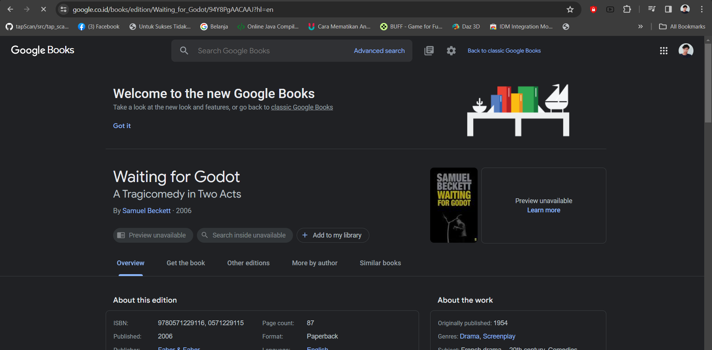
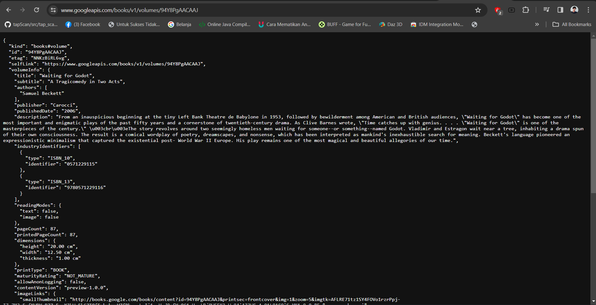
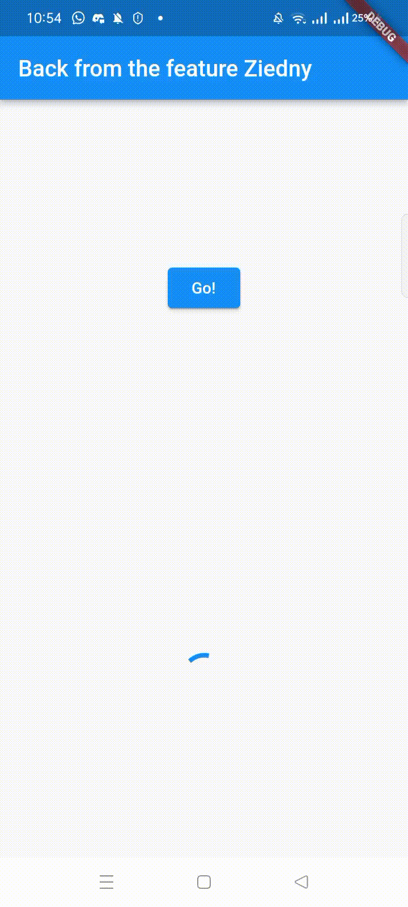
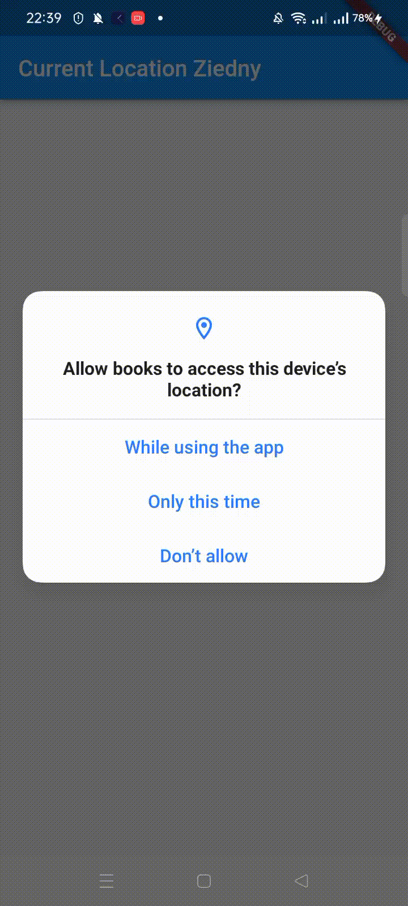
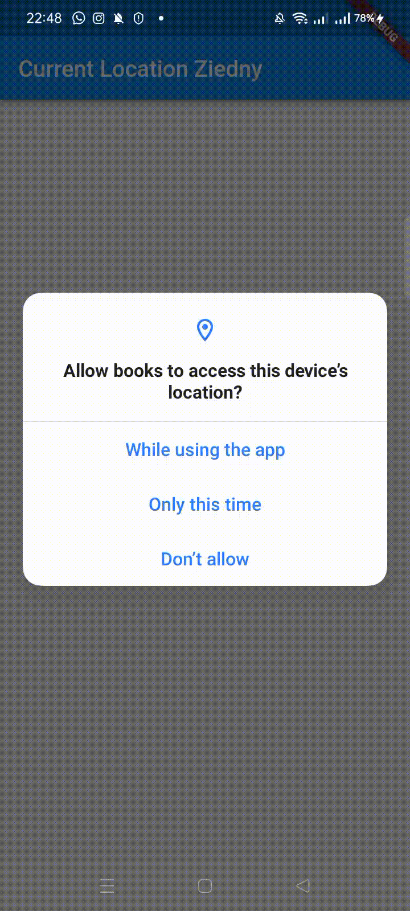
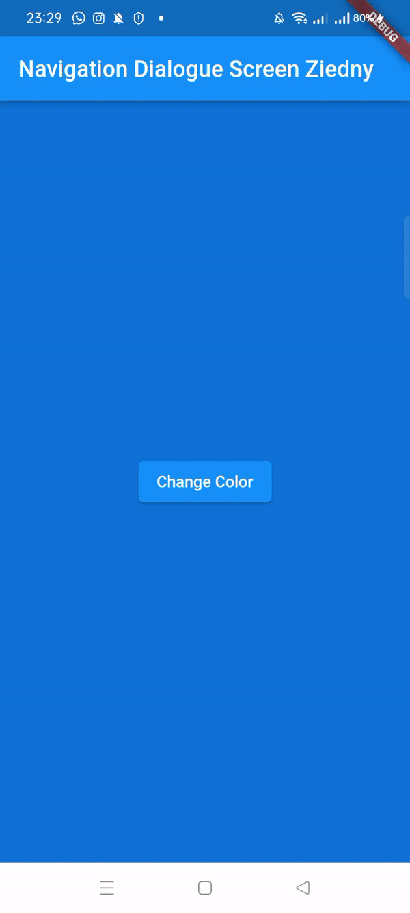

# Praktikum 1: Mengunduh Data dari Web Service (API)

## Langkah 1: Buat Project Baru

Buatlah sebuah project flutter baru dengan nama books di folder src week-12 repository GitHub Anda.

Kemudian Tambahkan dependensi http dengan mengetik perintah berikut di terminal.
```
flutter pub add http
```

## Langkah 2: Cek file pubspec.yaml

Jika berhasil install plugin, pastikan plugin http telah ada di file pubspec ini seperti berikut.

```yaml
dependencies:
  flutter:
    sdk: flutter


  # The following adds the Cupertino Icons font to your application.
  # Use with the CupertinoIcons class for iOS style icons.
  cupertino_icons: ^1.0.2
  http: ^1.1.0
  geolocator: ^10.1.0
```

## Langkah 3: Buka file main.dart

Ketiklah kode seperti berikut ini.

Soal 1
Tambahkan nama panggilan Anda pada title app sebagai identitas hasil pekerjaan Anda.

```dart
import 'dart:async';

import 'package:flutter/material.dart';
import 'package:http/http.dart';
import 'package:http/http.dart' as http;

void main() {
  runApp(const MyApp());
}

class MyApp extends StatelessWidget {
  const MyApp({super.key});

  @override
  Widget build(BuildContext context) {
    return MaterialApp(
      title: 'Future Demo Ziedny',
      theme: ThemeData(
        primarySwatch: Colors.blue,
        visualDensity: VisualDensity.adaptivePlatformDensity,
      ),
      home: const FuturePage(),
    );
  }
}

class FuturePage extends StatefulWidget {
  const FuturePage({super.key});

  @override
  State<FuturePage> createState() => _FuturePageState();
}

class _FuturePageState extends State<FuturePage> {
  String result = '';
  @override
  Widget build(BuildContext context) {
    return Scaffold(
      appBar: AppBar(
        title: const Text('Back from the feature Ziedny'),
      ),
      body: Center(
        child: Column(
          children: [
            const Spacer(),
            ElevatedButton(
              onPressed: () {
               
              },
              child: const Text('Go!'),
            ),
            const Spacer(),
            Text(result),
            const Spacer(),
            const CircularProgressIndicator(),
            const Spacer()
          ],
        ),
      ),
    );
  }
}
```

## Langkah 4: Tambah method getData()

Tambahkan method ini ke dalam class _FuturePageState yang berguna untuk mengambil data dari API Google Books.

```dart
  Future<Response> getData() async {
    const authority = 'www.googleapis.com';
    const path = '/books/v1/volumes/94Y8PgAACAAJ';
    Uri uri = Uri.https(authority, path);
    return http.get(uri);
  }
```


## Soal 2

Carilah judul buku favorit Anda di Google Books, lalu ganti ID buku pada variabel path di kode tersebut. Caranya ambil di URL browser Anda seperti gambar berikut ini.



Kemudian cobalah akses di browser URI tersebut dengan lengkap seperti ini. Jika menampilkan data JSON, maka Anda telah berhasil. Lakukan capture milik Anda dan tulis di README pada laporan praktikum. Lalu lakukan commit dengan pesan "W12: Soal 2".




## Langkah 5: Tambah kode di ElevatedButton

Tambahkan kode pada onPressed di ElevatedButton seperti berikut.

```dart
   ElevatedButton(
              onPressed: () {
                getData().then((value) {
                  setState(() {
                    result = value.body.toString().substring(0, 450);
                  });
                }).catchError((_) {
                  setState(() {
                    result = 'An Error Occured';
                  });
                });
              },
              child: const Text('Go!'),
            ),
```

## Soal 3

Jelaskan maksud kode langkah 5 tersebut terkait substring dan catchError!
Capture hasil praktikum Anda berupa GIF dan lampirkan di README. Lalu lakukan commit dengan pesan "W12: Soal 3".

**jawaban**
nama message github: "**week 12 initial commit, prak1**"
substring adalah mengambil sebagian dari text, sedangkan cathError adalah antisipasi jika terjadi error maka kode selanjutnya(dalam {}) akan dijalankan 


# Praktikum 2: Menggunakan await/async untuk menghindari callbacks

## Langkah 1: Buka file main.dart
Tambahkan tiga method berisi kode seperti berikut di dalam class _FuturePageState.

```dart
import 'dart:async';

import 'package:flutter/material.dart';
import 'package:http/http.dart';
import 'package:http/http.dart' as http;

void main() {
  runApp(const MyApp());
}

class MyApp extends StatelessWidget {
  const MyApp({super.key});

  @override
  Widget build(BuildContext context) {
    return MaterialApp(
      title: 'Future Demo Ziedny',
      theme: ThemeData(
        primarySwatch: Colors.blue,
        visualDensity: VisualDensity.adaptivePlatformDensity,
      ),
      home: const FuturePage(),
    );
  }
}

class FuturePage extends StatefulWidget {
  const FuturePage({super.key});

  @override
  State<FuturePage> createState() => _FuturePageState();
}

class _FuturePageState extends State<FuturePage> {

  @override
  Widget build(BuildContext context) {
    return return Scaffold(
      appBar: AppBar(
        title: const Text('Back from the feature Ziedny'),
      ),
      body: Center(
        child: Column(
          children: [
            const Spacer(),
            ElevatedButton(
              onPressed: () {
                count();
              },
              child: const Text('Go!'),
            ),
            const Spacer(),
            Text(result),
            const Spacer(),
            const CircularProgressIndicator(),
            const Spacer()
          ],
        ),
      ),
    );

  Future<int> returnOneAsync() async {
    await Future.delayed(const Duration(seconds: 3));
    return 1;
  }

  Future<int> returnTwoAsync() async {
    await Future.delayed(const Duration(seconds: 3));
    return 2;
  }

  Future<int> returnThreeAsync() async {
    await Future.delayed(const Duration(seconds: 3));
    return 3;
  }
  }
    void updateResult(String value) {
    setState(() {
      result = value;
    });
  }
}
```

## Langkah 2: Tambah method count()
Lalu tambahkan lagi method ini di bawah ketiga method sebelumnya.

```dart
class _FuturePageState extends State<FuturePage> {

...
Future count() async {
    int total = 0;
    updateResult(total.toString());
    total += await returnOneAsync();
    updateResult(total.toString());
    total += await returnTwoAsync();
    updateResult(total.toString());
    total += await returnThreeAsync();
    updateResult(total.toString());
  }
}

```

## Langkah 3: Panggil count()
Lakukan comment kode sebelumnya, ubah isi kode onPressed() menjadi seperti berikut.

## Langkah 4: Run
Akhirnya, run atau tekan F5 jika aplikasi belum running. Maka Anda akan melihat seperti gambar berikut, hasil angka 6 akan tampil setelah delay 9 detik.


## Soal 4

Jelaskan maksud kode langkah 1 dan 2 tersebut!
Capture hasil praktikum Anda berupa GIF dan lampirkan di README. Lalu lakukan commit dengan pesan "W12: Soal 4".

**Jawaban**

commit message = prak2

pada langkah 1 kita membaut 3 fungsi untuk mengembalikan nilai, namun tidak langsung di return melainkan di return setelah 3 detik untuk tiap fungsi oleh karena itu waktu tunggu hingga nilai yang ditampilkan menjadi 6 adalah 9 detik.

Pada langkah 2 kita menototal angka yang di return oleh fungsi, namun fungsi ini adalah fungsi future yang artinya baris kode tidak langsung dijalankan, maksudnya adalah angka akan ditambahkan setelah menunggu 3 detik

# Praktikum 3: Menggunakan Completer di Future

## Langkah 1: Buka main.dart

Pastikan telah impor package async berikut.
```dart
import 'package:async/async.dart';
```

## Langkah 2: Tambahkan variabel dan method

Tambahkan variabel late dan method di class _FuturePageState seperti ini.

```dart
class _FuturePageState extends State<FuturePage> {

  late Completer completer;
  @override
  Widget build(BuildContext context) {
   ...
  }

  Future getNumber() {
    completer = Completer<int>();
    calculate();
    return completer.future;
  }

  Future calculate() async {
    await Future.delayed(const Duration(seconds: 5));
    completer.complete(42);
  }
...
}
```

## Langkah 3: Ganti isi kode onPressed()
Tambahkan kode berikut pada fungsi onPressed(). Kode sebelumnya bisa Anda comment.

```dart
class _FuturePageState extends State<FuturePage> {
  String result = '';
  late Completer completer;
  @override
  Widget build(BuildContext context) {
    return Scaffold(
      appBar: AppBar(
        title: const Text('Back from the feature Ziedny'),
      ),
      body: Center(
        child: Column(
          children: [
            const Spacer(),
            ElevatedButton(
              onPressed: () {
                getNumber().then((value) {
                  setState(() {
                    result = value.toString();
                  });
                });
              },
              child: const Text('Go!'),
            ),
            const Spacer(),
            Text(result),
            const Spacer(),
            const CircularProgressIndicator(),
            const Spacer()
          ],
        ),
      ),
    );
  }

  Future getNumber() {
    completer = Completer<int>();
    calculate();
    return completer.future;
  }

  Future calculate() async {
    await Future.delayed(const Duration(seconds: 5));
    completer.complete(42);
  }
...
}
```

## Langkah 4:

Terakhir, run atau tekan F5 untuk melihat hasilnya jika memang belum running. Bisa juga lakukan hot restart jika aplikasi sudah running. Maka hasilnya akan seperti gambar berikut ini. Setelah 5 detik, maka angka 42 akan tampil.

## Soal 5

Jelaskan maksud kode langkah 2 tersebut!
Capture hasil praktikum Anda berupa GIF dan lampirkan di README. Lalu lakukan commit dengan pesan "W12: Soal 5".

**Jawaban**

ketika tombol di klik akan memanggil fungsi getNumber yang akan memenggil fungsi calculate dengan delay 5 detik

commit message = prak3 soal5



## Langkah 5: Ganti method calculate()

Gantilah isi code method calculate() seperti kode berikut, atau Anda dapat membuat calculate2()

```dart
  Future calculate() async {
    try {
      await Future.delayed(const Duration(seconds: 5));
      completer.complete(42);
    } catch (_) {
      completer.completeError({});
    }
  }
```

## Langkah 6: Pindah ke onPressed()
Ganti menjadi kode seperti berikut.

```dart
@override
  Widget build(BuildContext context) {
    return Scaffold(
      appBar: AppBar(
        title: const Text('Back from the feature Ziedny'),
      ),
      body: Center(
        child: Column(
          children: [
            const Spacer(),
            ElevatedButton(
              onPressed: () {
                getNumber().then((value) {
                  updateResult(value.toString());
                }).catchError((e) {
                  updateResult('An error occured');
                });
              },
              child: const Text('Go!'),
            ),
            const Spacer(),
            Text(result),
            const Spacer(),
            const CircularProgressIndicator(),
            const Spacer()
          ],
        ),
      ),
    );
  }
```

## Soal 6
Jelaskan maksud perbedaan kode langkah 2 dengan langkah 5-6 tersebut!
Capture hasil praktikum Anda berupa GIF dan lampirkan di README. Lalu lakukan commit dengan pesan "W12: Soal 6".

**Jawaban**

yang dilakukan adalah memberikan try catch pada fungsi calculate


# Praktikum 4: Memanggil Future secara paralel

Ketika Anda membutuhkan untuk menjalankan banyak Future secara bersamaan, ada sebuah class yang dapat Anda gunakan yaitu: FutureGroup.

FutureGroup tersedia di package async, yang mana itu harus diimpor ke file dart Anda, seperti berikut.
```dart
import 'package:async/async.dart';
```

## Langkah 1: Buka file main.dart

Tambahkan method ini ke dalam class _FuturePageState

```dart
 void returnFG() {
    FutureGroup<int> futureGroup = FutureGroup<int>();
    futureGroup.add(returnOneAsync());
    futureGroup.add(returnTwoAsync());
    futureGroup.add(returnThreeAsync());
    futureGroup.close();

    futureGroup.future.then((List<int> value) {
      int total = 0;
      for (var element in value) {
        total += element;
      }
      updateResult(total.toString());
    });
  }
```

## Langkah 2: Edit onPressed()

Anda bisa hapus atau comment kode sebelumnya, kemudian panggil method dari langkah 1 tersebut.

```dart
@override
  Widget build(BuildContext context) {
    return Scaffold(
      appBar: AppBar(
        title: const Text('Back from the feature Ziedny'),
      ),
      body: Center(
        child: Column(
          children: [
            const Spacer(),
            ElevatedButton(
              onPressed: () {
                returnFG();
              },
              child: const Text('Go!'),
            ),
            const Spacer(),
            Text(result),
            const Spacer(),
            const CircularProgressIndicator(),
            const Spacer()
          ],
        ),
      ),
    );
  }
```

## Langkah 3: Run

Anda akan melihat hasilnya dalam 3 detik berupa angka 6 lebih cepat dibandingkan praktikum sebelumnya menunggu sampai 9 detik.

## Soal 7

Capture hasil praktikum Anda berupa GIF dan lampirkan di README. Lalu lakukan commit dengan pesan "W12: Soal 7".


## Langkah 4: Ganti variabel futureGroup

Anda dapat menggunakan FutureGroup dengan Future.wait seperti kode berikut.

```dart
void returnFG() {
    FutureGroup<int> futureGroup = FutureGroup<int>();

      final futures = Future.wait<int>([
       returnOneAsync(),
       returnTwoAsync(),
       returnThreeAsync(),
    ]);

    
  }
```


## Soal 8
Jelaskan maksud perbedaan kode langkah 1 dan 4!

**Jawaban**

# Praktikum 5: Menangani Respon Error pada Async Code

## Langkah 1: Buka file main.dart

Tambahkan method ini ke dalam class _FuturePageState

```dart

  Future returnError() async {
    await Future.delayed(const Duration(seconds: 2));
    throw Exception('Something terrible happend');
  }

```

## Langkah 2: ElevatedButton

Ganti dengan kode berikut

```dart
ElevatedButton(
              onPressed: () {
                returnError()
                    .then((value) => setState(() {
                          result = "success";
                        }))
                    .catchError((onError) => setState(() {
                          result = onError.toString();
                        }))
                    .whenComplete(() => print('complete'));
              },
              child: const Text('Go!'),
            ),
```

## Langkah 3: Run

Lakukan run dan klik tombol GO! maka akan menghasilkan seperti gambar berikut.


Pada bagian debug console akan melihat teks Complete seperti berikut.

```I/flutter (27854): Complete```

## Soal 9

Capture hasil praktikum Anda berupa GIF dan lampirkan di README. Lalu lakukan commit dengan pesan "W12: Soal 9".


## Langkah 4: Tambah method handleError()

Tambahkan kode ini di dalam class _FutureStatePage

```dart
 Future handleError() async {
    try {
      await returnError();
    } catch (error) {
      updateResult(error.toString());
    } finally {
      print("complete");
    }
  }

  void updateResult(String value) {
    setState(() {
      result = value;
    });
  }
```

## Soal 10

Panggil method handleError() tersebut di ElevatedButton, lalu run. Apa hasilnya? Jelaskan perbedaan kode langkah 1 dan 4!

```dart
 ElevatedButton(
              onPressed: () {
                handleError();
              },
              child: const Text('Go!'),
            ),
```

**Jawaban**

  kurang lebih sama, namun kini yang dijalankan adalah catch, juga terdapat finaly yang akan mencetak complete jika try catch selesai


# Praktikum 6: Menggunakan Future dengan StatefulWidget

## Langkah 1: install plugin geolocator
Tambahkan plugin geolocator dengan mengetik perintah berikut di terminal.

```
flutter pub add geolocator
```

## Langkah 2: Tambah permission GPS
Jika Anda menargetkan untuk platform Android, maka tambahkan baris kode berikut di file android/app/src/main/androidmanifest.xml

```xml
<manifest xmlns:android="http://schemas.android.com/apk/res/android">
<uses-permission android:name="android.permission.ACCESS_FINE_LOCATION"/>
<uses-permission android:name="android.permission.ACCESS_COARSE_LOCATION"/>
    <application
    ...
```

## Langkah 3: Buat file geolocation.dart

Tambahkan file baru ini di folder lib project Anda.

## Langkah 4: Buat StatefulWidget

Buat class LocationScreen di dalam file geolocation.dart

```dart
import 'package:flutter/material.dart';
import 'package:geolocator/geolocator.dart';

class LocationScreen extends StatefulWidget {
  const LocationScreen({super.key});

  @override
  State<LocationScreen> createState() => _LocationScreenState();
}

class _LocationScreenState extends State<LocationScreen> {
   @override
  Widget build(BuildContext context) {
    return Scaffold()
  }
}
```

## Langkah 5: Isi kode geolocation.dart

```dart
import 'package:flutter/material.dart';
import 'package:geolocator/geolocator.dart';

class LocationScreen extends StatefulWidget {
  const LocationScreen({super.key});

  @override
  State<LocationScreen> createState() => _LocationScreenState();
}

class _LocationScreenState extends State<LocationScreen> {
  String myPosition = '';

  @override
  void initState() {
    super.initState();
    getPosition().then((Position myPos) {
      myPosition =
          'Latitude: ${myPos.latitude.toString()} - Longitude: ${myPos.longitude.toString()}';
      setState(() {
        myPosition = myPosition;
      });
    });
  }

  @override
  Widget build(BuildContext context) {
    return Scaffold(
      appBar: AppBar(title: const Text('Current Location')),
      body: Center(child: Text(myPosition)),
    );
  }

  Future<Position> getPosition() async {
    await Geolocator.requestPermission();
    await Geolocator.isLocationServiceEnabled();
    Position? position = await Geolocator.getCurrentPosition();
    return position;
  }
}
}

```

## Soal 11
Tambahkan nama panggilan Anda pada tiap properti title sebagai identitas pekerjaan Anda.

```dart
  @override
  Widget build(BuildContext context) {
    return Scaffold(
      appBar: AppBar(title: const Text('Current Location Ziedny')),
      ...
    )
  }
```

## Langkah 6: Edit main.dart

Panggil screen baru tersebut di file main Anda seperti berikut.

```dart
@override
  Widget build(BuildContext context) {
    return MaterialApp(
        title: 'Future Demo Ziedny',
        theme: ThemeData(
          primarySwatch: Colors.blue,
          visualDensity: VisualDensity.adaptivePlatformDensity,
        ),
        home: const LocationScreen());
  }
```

## Langkah 7: Run

Run project Anda di device atau emulator (bukan browser), maka akan tampil seperti berikut ini.



## Langkah 8: Tambahkan animasi loading

Tambahkan widget loading seperti kode berikut. Lalu hot restart, perhatikan perubahannya.

```dart
  @override
  Widget build(BuildContext context) {
    final myWidget =
        myPosition == '' ? const CircularProgressIndicator() : Text(myPosition);
    return Scaffold(
      appBar: AppBar(title: const Text('Current Location Ziedny')),
      body: Center(child: myWidget),
    );
  }
```

## Soal 12

Jika Anda tidak melihat animasi loading tampil, kemungkinan itu berjalan sangat cepat. Tambahkan delay pada method getPosition() dengan kode await Future.delayed(const Duration(seconds: 3));
Apakah Anda mendapatkan koordinat GPS ketika run di browser? Mengapa demikian?
Capture hasil praktikum Anda berupa GIF dan lampirkan di README. Lalu lakukan commit dengan pesan "W12: Soal 12".

**Jawaban**

tidak diaapat koordinat gps pada browser karena perizinan hanya di setting untuk android


#  Praktikum 7: Manajemen Future dengan FutureBuilder

## Langkah 1: Modifikasi method getPosition()

```dart
 Future<Position> getPosition() async {
await Geolocator.isLocationServiceEnabled();
await Future.delayed (const Duration(seconds: 3));
Position position = await Geolocator. getCurrentPosition (); return position; 
}
```

## Langkah 2: Tambah variabel

```dart
Future<Position>? position;
```

## Langkah 3: Tambah initState()
```dart
@override
void initState() {
super.initState();
position = getPosition();
}
```

## Langkah 4: Edit method build()

```dart
 @override
  Widget build(BuildContext context) {
    return Scaffold(
      appBar: AppBar(title: const Text('Current Location Ziedny')),
      body: Center(
          child: FutureBuilder(
        future: position,
        builder: (BuildContext context, AsyncSnapshot<Position> snapshot) {
          if (snapshot.connectionState == ConnectionState.waiting) {
            return const CircularProgressIndicator();
          } else if (snapshot.connectionState == ConnectionState.done) {
            return Text(snapshot.data.toString());
          } else {
            return const Text('');
          }
        },
      )),
    );
  }
```

## Soal 13: Apakah ada perbedaan UI dengan praktikum sebelumnya? Mengapa demikian?
Capture hasil praktikum Anda berupa GIF dan lampirkan di README. Lalu lakukan commit dengan pesan "W12: Soal 13".
Seperti yang Anda lihat, menggunakan FutureBuilder lebih efisien, clean, dan reactive dengan Future bersama UI.



**Jawaban**
perbedaan terletak pada variable position yang dijalankan pada awal aplikasi sehingga ditampilkan loading 3 detik sebelum menampilkan hasil 

## Langkah 5: Tambah handling error
Tambahkan kode berikut untuk menangani ketika terjadi error. Kemudian hot restart.

```dart
else if (snapshot.connectionState == ConnectionState.done) {
  if (snapshot.hasError) {
     return Text('Something terrible happened!');
  }
  return Text(snapshot.data.toString());
}
```
## Soal 14
Apakah ada perbedaan UI dengan langkah sebelumnya? Mengapa demikian?
Capture hasil praktikum Anda berupa GIF dan lampirkan di README. Lalu lakukan commit dengan pesan "W12: Soal 14".

**Jawaban**

tidak ada perbedaan karena tidak ada error, namun jika ada error, maka text 'Something terrible happened!' akan muncul

# Praktikum 8: Navigation route dengan Future Function

```dart
import 'package:books/view/navigation_second.dart';
import 'package:flutter/material.dart';

class NavigationFirst extends StatefulWidget {
  const NavigationFirst({super.key});

  @override
  State<NavigationFirst> createState() => _NavigationFirstState();
}

class _NavigationFirstState extends State<NavigationFirst> {
  Color color = Colors.blue.shade700;
  @override
  Widget build(BuildContext context) {
    return Scaffold(
      backgroundColor: color,
      appBar: AppBar(
        title: const Text('Navigation First Screen'),
      ),
      body: Center(
        child: ElevatedButton(
          child: const Text('change color'),
          onPressed: () {
            _navigationAndGetColor(context);
          },
        ),
      ),
    );
  }
}
```

## Soal 15 Tambahkan nama panggilan Anda pada tiap properti title sebagai identitas pekerjaan Anda.
Silakan ganti dengan warna tema favorit Anda.

```dart
  @override
  Widget build(BuildContext context) {
    return Scaffold(
      backgroundColor: color,
      appBar: AppBar(
        title: const Text('Navigation First Screen Ziedny'),
      ),
      ...
```

## Langkah 3: Tambah method di class _NavigationFirstState
Tambahkan method ini.
```dart
  Future _navigationAndGetColor(BuildContext context) async {
    color = await Navigator.push(
          context,
          MaterialPageRoute(builder: (context) => const NavigationSecond()),
        ) ??
        Colors.blue;
    setState(() {});
  }
```

## Langkah 4: Buat file baru navigation_second.dart

## Langkah 5: Buat class NavigationSecond dengan StatefulWidget

```dart
import 'package:flutter/material.dart';

class NavigationSecond extends StatefulWidget {
  const NavigationSecond({super.key});

  @override
  State<NavigationSecond> createState() => _NavigationSecondState();
}

class _NavigationSecondState extends State<NavigationSecond> {
  @override
  Widget build(BuildContext context) {
    Color color;
    return Scaffold(
      appBar: AppBar(
        title: const Text("Navigation Second Screen"),
      ),
      body: Center(
          child: Column(
        mainAxisAlignment: MainAxisAlignment.spaceEvenly,
        children: [
          ElevatedButton(
              onPressed: () {
                color = Colors.red.shade700;
                Navigator.pop(context, color);
              },
              child: const Text("Red")),
          ElevatedButton(
              onPressed: () {
                color = Colors.green.shade700;
                Navigator.pop(context, color);
              },
              child: const Text("Green")),
          ElevatedButton(
              onPressed: () {
                color = Colors.blue.shade700;
                Navigator.pop(context, color);
              },
              child: const Text("Blue")),
        ],
      )),
    );
  }
}
```

## Langkah 6: Edit main.dart

```dart

class MyApp extends StatelessWidget {
  const MyApp({super.key});

  @override
  Widget build(BuildContext context) {
    return MaterialApp(
        title: 'Future Demo Ziedny',
        theme: ThemeData(
          primarySwatch: Colors.blue,
          visualDensity: VisualDensity.adaptivePlatformDensity,
        ),
        home: const NavigationFirst());
  }
}
```

## Langkah 8: Run


## Soal 16

Cobalah klik setiap button, apa yang terjadi ? Mengapa demikian ?

Gantilah 3 warna pada langkah 5 dengan warna favorit Anda!
Capture hasil praktikum Anda berupa GIF dan lampirkan di README. Lalu lakukan commit dengan pesan "W12: Soal 16".

**Jawaban**

kita mengubah background color menggunakan parameter dari navigation pop


# Praktikum 9: Memanfaatkan async/await dengan Widget Dialog

## Langkah 1: Buat file baru navigation_dialog.dart

## Langkah 2: Isi kode navigation_dialog.dart

```dart
import 'package:flutter/material.dart';

class NavigationDialogueScreen extends StatefulWidget {
  const NavigationDialogueScreen({super.key});

  @override
  State<NavigationDialogueScreen> createState() =>
      _NavigationDialogueScreenState();
}

class _NavigationDialogueScreenState extends State<NavigationDialogueScreen> {
  Color color = Colors.blue.shade700;
  @override
  Widget build(BuildContext context) {
    return Scaffold(
      backgroundColor: color,
      appBar: AppBar(title: const Text('Navigation Dialogue Screen Ziedny')),
      body: Center(
          child: ElevatedButton(
        child: const Text('Change Color'),
        onPressed: () {
          
        },
      )),
    );
  }
```

## Langkah 3: Tambah method async

```dart
  _showColorDialogue(BuildContext context) async {
    await showDialog(
      barrierDismissible: false,
      context: context,
      builder: (_) {
        return AlertDialog(
          title: const Text('Very important question'),
          content: const Text('Please choose a color'),
          actions: <Widget>[
            TextButton(
                child: const Text('Red'),
                onPressed: () {
                  color = Colors.red.shade700;
                  Navigator.pop(context, color);
                }),
            TextButton(
                child: const Text('Green'),
                onPressed: () {
                  color = Colors.green.shade700;
                  Navigator.pop(context, color);
                }),
            TextButton(
                child: const Text('Blue'),
                onPressed: () {
                  color = Colors.blue.shade700;
                  Navigator.pop(context, color);
                }),
          ],
        );
      },
    );
    setState(() {});
  }
}
```

## Langkah 4: Panggil method di ElevatedButton

```dart
ElevatedButton(
        child: const Text('Change Color'),
        onPressed: () {
          _showColorDialogue(context);
        },
      )
```

## Langkah 5: Edit main.dart

```dart
@override
  Widget build(BuildContext context) {
    return MaterialApp(
        title: 'Future Demo Ziedny',
        theme: ThemeData(
          primarySwatch: Colors.blue,
          visualDensity: VisualDensity.adaptivePlatformDensity,
        ),
        home: const NavigationDialogueScreen());
  }
```

## Langkah 6: Run



## Soal 17
Cobalah klik setiap button, apa yang terjadi ? Mengapa demikian ?
Gantilah 3 warna pada langkah 3 dengan warna favorit Anda!
Capture hasil praktikum Anda berupa GIF dan lampirkan di README. Lalu lakukan commit dengan pesan "W12: Soal 17".

**Jawaban**

kuranng lebih sama namun dilakukan dari popup menggunakan alertdialog