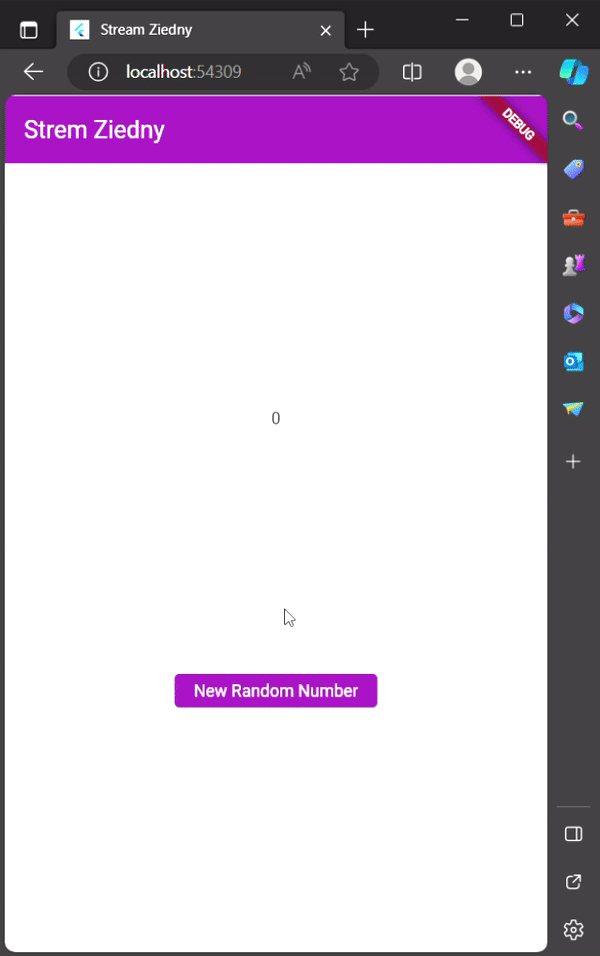
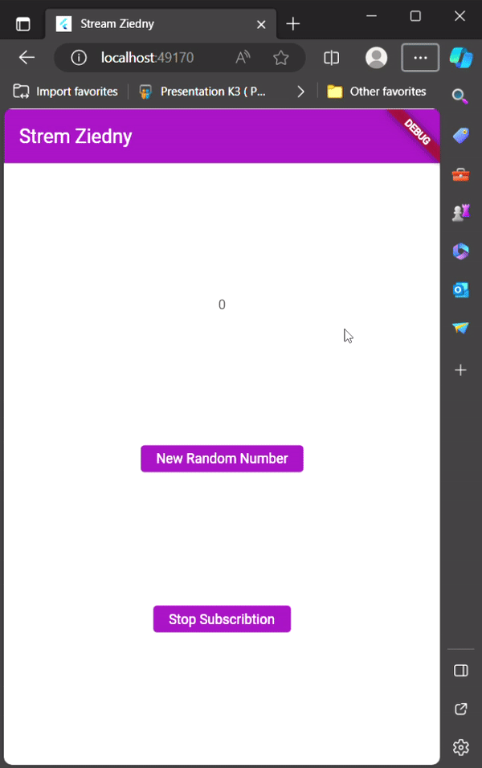
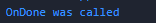
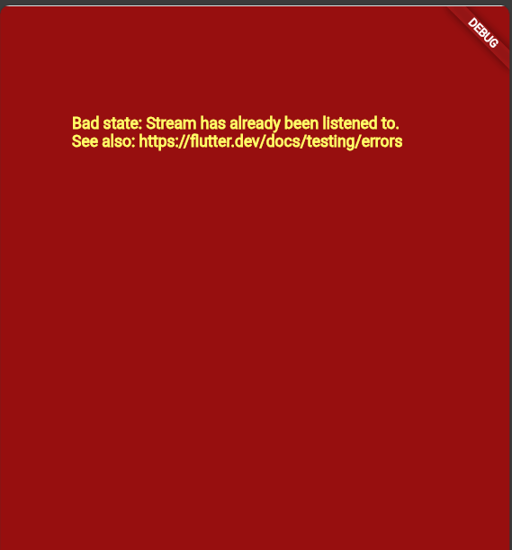
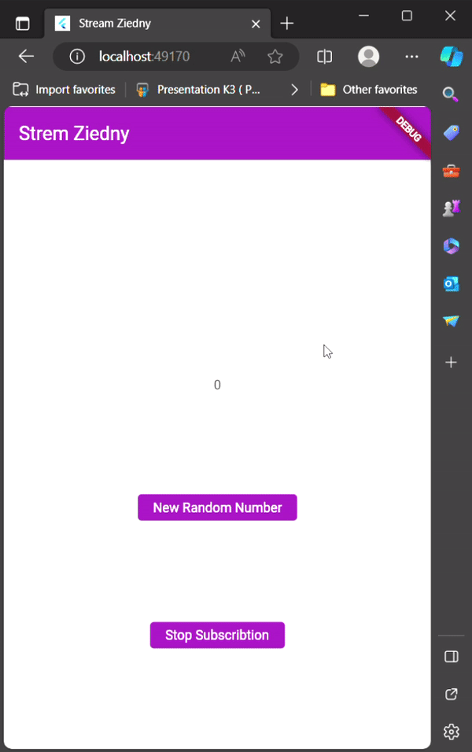
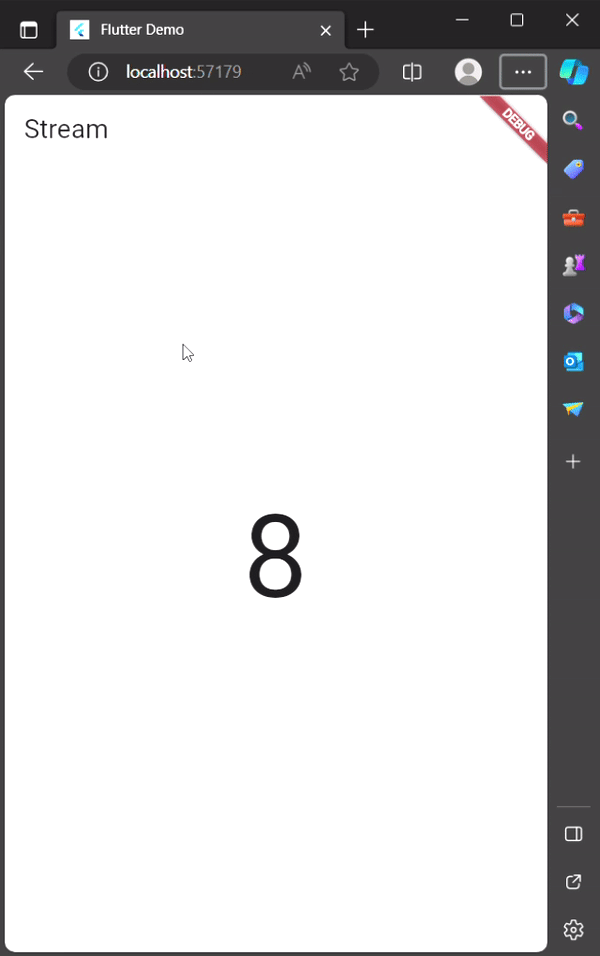
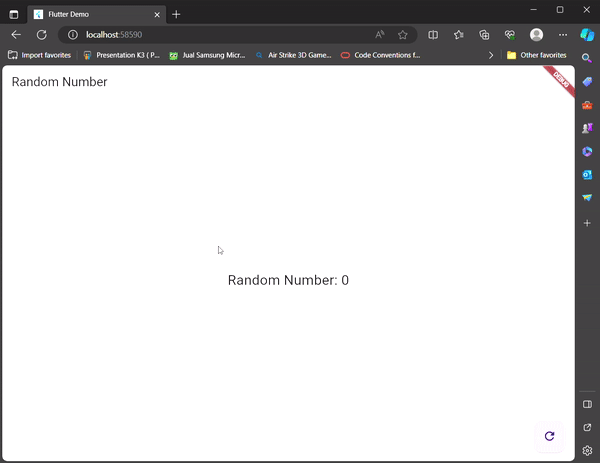

# Praktikum 1: Dart Streams

## Langkah 1: Buat Project Baru

## Langkah 2: Buka file main.dart

main.dart:
```dart
import 'package:flutter/material.dart';

void main() {
  runApp(const MyApp());
}

class MyApp extends StatelessWidget {
  const MyApp({super.key});

  // This widget is the root of your application.
  @override
  Widget build(BuildContext context) {
    return MaterialApp(
      title: 'Stream',
      theme: ThemeData(primarySwatch: Colors.purple),
      home: const StreamHomePage(),
    );
  }
}

class StreamHomePage extends StatefulWidget {
  const StreamHomePage({super.key});

  @override
  State<StreamHomePage> createState() => _StreamHomePageState();
}

class _StreamHomePageState extends State<StreamHomePage> {
  @override
  Widget build(BuildContext context) {
    return Container();
  }
}

```

## Soal 1

- Tambahkan nama panggilan Anda pada title app sebagai identitas hasil pekerjaan Anda.
- Gantilah warna tema aplikasi sesuai kesukaan Anda.
- Lakukan commit hasil jawaban Soal 1 dengan pesan "W13: Jawaban Soal 1"

## Langkah 3: Buat file baru stream.dart

stream.dart:
```dart
import 'package:flutter/material.dart';

class ColorStream {

}
```

## Langkah 4: Tambah variabel colors

stream.dart:
```dart
class ColorStream {
  final List<Color> colors = [
    Colors.blueGrey,
    Colors.amber,
    Colors.deepPurple,
    Colors.lightBlue,
    Colors.teal,
  ];
}
```

## Soal 2
- Tambahkan 5 warna lainnya sesuai keinginan Anda pada variabel colors tersebut.
- Lakukan commit hasil jawaban Soal 2 dengan pesan "W13: Jawaban Soal 2"

## Langkah 5: Tambah method getColors()

stream.dart:
```dart
  Stream<Color> getColors() async* {}
```

## Langkah 6: Tambah perintah yield*

stream.dart:
```dart
 Stream<Color> getColors() async* {
    yield* Stream.periodic(
      const Duration(seconds: 1),
      (int t) {
        int index = t % colors.length;
        return colors[index];
      },
    );
  }
```
## Soal 3
- Jelaskan fungsi keyword yield* pada kode tersebut!
- Apa maksud isi perintah kode tersebut?
- Lakukan commit hasil jawaban Soal 3 dengan pesan "W13: Jawaban Soal 3"

**Jawaban**

Keyword yield* pada kode tersebut digunakan untuk menghasilkan nilai dari stream lain. Dalam kasus ini, nilai yang dihasilkan adalah nilai dari stream Stream.periodic(). Stream Stream.periodic() akan menghasilkan nilai baru setiap detik.

## Langkah 7: Buka main.dart

main.dart:
```dart
import 'stream.dart';
```

## Langkah 8: Tambah variabel

main.dart
```dart
class _StreamHomePageState extends State<StreamHomePage> {
  Color bgColor = Colors.blueGrey;
  late ColorStream colorStream;
  @override
  Widget build(BuildContext context) {
    return Container();
  }
}
```

## Langkah 9: Tambah method changeColor()

main.dart

```dart

class _StreamHomePageState extends State<StreamHomePage> {
  Color bgColor = Colors.blueGrey;
  late ColorStream colorStream;
  @override
  Widget build(BuildContext context) {
    return Container();
  }

  void changeColor() async {
    await for (var eventColor in colorStream.getColors()) {
      setState(() {
        bgColor = eventColor;
      });
    }
  }
}

```

## Langkah 10: Lakukan override initState()

main.dart

```dart
class StreamHomePage extends StatefulWidget {
  const StreamHomePage({super.key});

  @override
  State<StreamHomePage> createState() => _StreamHomePageState();
}

class _StreamHomePageState extends State<StreamHomePage> {
  Color bgColor = Colors.blueGrey;
  late ColorStream colorStream;

  @override
  void initState() {
    super.initState();
    colorStream = ColorStream();
    changeColor();
  }

  @override
  Widget build(BuildContext context) {
    return Container();
  }

  void changeColor() async {
    await for (var eventColor in colorStream.getColors()) {
      setState(() {
        bgColor = eventColor;
      });
    }
  }
}
```

## Langkah 11: Ubah isi Scaffold()

main.dart

```dart
class _StreamHomePageState extends State<StreamHomePage> {
  Color bgColor = Colors.blueGrey;
  late ColorStream colorStream;

  @override
  void initState() {
  ...
  }

  @override
  Widget build(BuildContext context) {
    return Scaffold(
      appBar: AppBar(
        title: const Text('Strem'),
      ),
      body: Container(
        decoration: BoxDecoration(color: bgColor),
      ),
    );
  }

  void changeColor() async {
    ...
  }
}
```

## Langkah 12: Run

## Soal 4
- Capture hasil praktikum Anda berupa GIF dan lampirkan di README.
- Lakukan commit hasil jawaban Soal 4 dengan pesan "W13: Jawaban Soal 4"


## Langkah 13: Ganti isi method changeColor()

main.dart:

```dart

class _StreamHomePageState extends State<StreamHomePage> {
  Color bgColor = Colors.blueGrey;
  late ColorStream colorStream;

  @override
  void initState() {
    ...
    changeColor();
  }

  @override
  Widget build(BuildContext context) {
   ...
  }

  void changeColor() async {
    colorStream.getColors().listen((eventColor) {
      setState(() {
        bgColor = eventColor;
      });
    });
  }
}

```

## Soal 5
- Jelaskan perbedaan menggunakan listen dan await for (langkah 9) !
- Lakukan commit hasil jawaban Soal 5 dengan pesan "W13: Jawaban Soal 5"

**Jawaban**

Kode pertama menggunakan loop await for untuk mengulangi colorStream, kode akan menunggu setiap warna diberikan sebelum memperbarui warna latar belakang.

Kode kedua menggunakan metode listen untuk subscibe ke colorStream, kode akan diberitahu setiap kali warna baru diberikan, dan akan memperbarui warna latar belakang sesuai dengan itu. 

# Praktikum 2: Stream controllers dan sinks

## Langkah 1: Buka file stream.dart

stream.dart:

```dart
import 'dart:async';
```

## Langkah 2: Tambah class NumberStream

stream.dart:
```dart
class NumberStream {}
```

## Langkah 3: Tambah StreamController

stream.dart:
```dart
class NumberStream {
  final StreamController<int> controller = StreamController<int>();
}
```

## Langkah 4: Tambah method addNumberToSink

stream.dart:
```dart
class NumberStream {
  final StreamController<int> controller = StreamController<int>();

  void addNumberToSink(int newNumber) {
    controller.sink.add(newNumber);
  }
}
```

## Langkah 5: Tambah method close()

```dart

class NumberStream {
  final StreamController<int> controller = StreamController<int>();

  void addNumberToSink(int newNumber) {
    controller.sink.add(newNumber);
  }

  close() {
    controller.close();
  }
}
```

## Langkah 6: Buka main.dart

main.dart:
```dart
import 'dart:async';
import 'dart:math';
```

## Langkah 7: Tambah variabel

main.dart:

```dart
class _StreamHomePageState extends State<StreamHomePage> {
  Color bgColor = Colors.blueGrey;
  late ColorStream colorStream;

  int lateNumber = 0;
  late StreamController numberStreamController;
  late NumberStream numberStream;
```

## Langkah 8: Edit initState()

main.dart:

```dart

class _StreamHomePageState extends State<StreamHomePage> {
    ...

  int lastNumber = 0;
  late StreamController numberStreamController;
  late NumberStream numberStream;

  @override
  void initState() {
    super.initState();
    // colorStream = ColorStream();
    // changeColor();
    numberStream = NumberStream();
    numberStreamController = numberStream.controller;
    Stream stream = numberStreamController.stream;
    stream.listen((event) {
      setState(() {
        lastNumber = event;
      });
    });
  }

  @override
  Widget build(BuildContext context) {
   ...
  }

  void changeColor() async {
    ...
  }
}

```

##  Langkah 9: Edit dispose()

main.dart:

```dart

class _StreamHomePageState extends State<StreamHomePage> {
  ...
  int lastNumber = 0;
  late StreamController numberStreamController;
  late NumberStream numberStream;

  @override
  void initState() {
    super.initState();
    // colorStream = ColorStream();
    // changeColor();
    numberStream = NumberStream();
    numberStreamController = numberStream.controller;
    Stream stream = numberStreamController.stream;
    stream.listen((event) {
      setState(() {
        lastNumber = event;
      });
    });
  }

  @override
  Widget build(BuildContext context) {
   ...
  }

  void changeColor() async {
   ...
  }

  @override
  void dispose() {
    numberStreamController.close();
    super.dispose();
  }
}
```

## Langkah 10: Tambah method addRandomNumber()

main.dart:

```dart
void addRandomNumber() {
  Random random = Random();
  int myNum = random.nextInt(10);
  numberStream.addNumberToSink(myNum);
}
```

## Langkah 11: Edit method build()


```dart

class _StreamHomePageState extends State<StreamHomePage> {
  ...

  @override
  void initState() {
   ...
  }

  @override
  Widget build(BuildContext context) {
    return Scaffold(
        appBar: AppBar(
          title: const Text('Strem Ziedny'),
        ),
        body: SizedBox(
          width: double.infinity,
          child: Column(
              mainAxisAlignment: MainAxisAlignment.spaceEvenly,
              crossAxisAlignment: CrossAxisAlignment.center,
              children: [
                Text(lastNumber.toString()),
                ElevatedButton(
                  onPressed: () => addRandomNumber(),
                  child: const Text("New Random Number"),
                )
              ]),
        ));
  }

  void changeColor() async {
   ...
  }

  @override
  void dispose() {
  ...
  }

  void addRandomNumber() {
  ...
  }
}

```

## Langkah 12: Run


## Soal 6
- Jelaskan maksud kode langkah 8 dan 10 tersebut!
- Capture hasil praktikum Anda berupa GIF dan lampirkan di README.
- Lalu lakukan commit dengan pesan "W13: Jawaban Soal 6".

**jawaban**

yang terjadi adalah kita membuat instance dari NumberStream sehingga dapat menggunakan fungsi dan variable di dalamnya pada fungsi initState, kemudian pada void dispose dilakukan close

## Langkah 13: Buka stream.dart

stream.dart:

```dart
class NumberStream {
  ...

  addError() {
    controller.sink.addError('error');
  }
}

```

## Langkah 14: Buka main.dart

main.dart:

```dart
  @override
  void initState() {
    super.initState();
    // colorStream = ColorStream();
    // changeColor();
    numberStream = NumberStream();
    numberStreamController = numberStream.controller;
    Stream stream = numberStreamController.stream;
    stream.listen((event) {
      setState(() {
        lastNumber = event;
      });
    }).onError((error) {
      setState(() {
        lastNumber = -1;
      });
    });
  }
```

## Langkah 15: Edit method addRandomNumber()

main.dart:

```dart
 void addRandomNumber() {
    Random random = Random();
    // int myNum = random.nextInt(10);
    // numberStream.addNumberToSink(myNum);

    numberStream.addError();
  }
```

## Soal 7
- Jelaskan maksud kode langkah 13 sampai 15 tersebut!
- Kembalikan kode seperti semula pada Langkah 15, comment addError() agar Anda dapat melanjutkan ke praktikum 3 berikutnya.
- Lalu lakukan commit dengan pesan "W13: Jawaban Soal 7".

**Jawaban**

kita sengaja melakukan error pada addRandomNumber ketika di klik, akan error dan dijalankan oleh onError yang akan membuat angka -1 ditampilkan 

# Praktikum 3: Injeksi data ke streams

## Langkah 1: Buka main.dart

main.dart:

```dart
class _StreamHomePageState extends State<StreamHomePage> {

  late StreamTransformer transformer;
```

## Langkah 2: Tambahkan kode ini di initState

main.dart

```dart
  @override
  void initState() {
    super.initState();
    ...
    transformer = StreamTransformer<int, int>.fromHandlers(
        handleData: (value, sink) {
          sink.add(value * 10);
        },
        handleError: (error, trace, sink) {
          sink.add(-1);
        },
        handleDone: (sink) => sink.close());
  }

```

## Langkah 3: Tetap di initState

```dart

  @override
  void initState() {
    super.initState();
    // colorStream = ColorStream();
    // changeColor();
    numberStream = NumberStream();
    numberStreamController = numberStream.controller;
    Stream stream = numberStreamController.stream;

    transformer = StreamTransformer<int, int>.fromHandlers(
        handleData: (value, sink) {
          sink.add(value * 10);
        },
        handleError: (error, trace, sink) {
          sink.add(-1);
        },
        handleDone: (sink) => sink.close());

    stream.transform(transformer).listen((event) {
      setState(() {
        lastNumber = event;
      });
    }).onError((error) {
      setState(() {
        lastNumber = -1;
      });
    });
  }
```

```dart
  void addRandomNumber() {
    Random random = Random();
    int myNum = random.nextInt(10);
    numberStream.addNumberToSink(myNum);
  }
```

## Langkah 4: Run

## Soal 8
- Jelaskan maksud kode langkah 1-3 tersebut!
- Capture hasil praktikum Anda berupa GIF dan lampirkan di README.
- Lalu lakukan commit dengan pesan "W13: Jawaban Soal 8".

**jawaban**

kurang lebih sama namun ada trasnsformer yang akan mengubah hasil menjadi * 10



# Praktikum 4: Subscribe ke stream events

## Langkah 1: Tambah variabel

main.dart
```dart
  class _StreamHomePageState extends State<StreamHomePage> {
  ...
  late StreamSubscription subscription;
  ...
```

## Langkah 2: Edit initState()

main.dart:
```dart
@override
  void initState() {
    super.initState();
    // colorStream = ColorStream();
    // changeColor();
    numberStream = NumberStream();
    numberStreamController = numberStream.controller;
    Stream stream = numberStreamController.stream;

    subscription = stream.listen((event) {
      setState(() {
        lastNumber = event;
      });
    });

    // transformer = StreamTransformer<int, int>.fromHandlers(
    //     handleData: (value, sink) {
    //       sink.add(value * 10);
    //     },
    //     handleError: (error, trace, sink) {
    //       sink.add(-1);
    //     },
    //     handleDone: (sink) => sink.close());

    // stream.transform(transformer).listen((event) {
    //   setState(() {
    //     lastNumber = event;
    //   });
    // }).onError((error) {
    //   setState(() {
    //     lastNumber = -1;
    //   });
    // });
  }
```

## Langkah 3: Tetap di initState()

main.dart:
```dart
  @override
  void initState() {
    ...
    subscription.onError((error) {
      setState(() {
        lastNumber = -1;
      });
    });
    ...
```

## Langkah 4: Tambah properti onDone()

main.dart:
```dart
  @override
  void initState() {
    ...

    subscription.onDone(() {
      print('OnDone was called');
    });
    ...

```

## Langkah 5: Tambah method baru

main.dart:

```dart
  void stopStream() {
    numberStreamController.close();
  }
```

## Langkah 6: Pindah ke method dispose()

main.dart:
```dart
  @override
  void dispose() {
    numberStreamController.close();
    subscription.cancel();
    super.dispose();
  }
```

## Langkah 7: Pindah ke method build()

main.dart:
```dart
  @override
  Widget build(BuildContext context) {
    return Scaffold(
        appBar: AppBar(
          title: const Text('Strem Ziedny'),
        ),
        body: SizedBox(
          width: double.infinity,
          child: Column(
              mainAxisAlignment: MainAxisAlignment.spaceEvenly,
              crossAxisAlignment: CrossAxisAlignment.center,
              children: [
                Text(lastNumber.toString()),
                ElevatedButton(
                  onPressed: () => addRandomNumber(),
                  child: const Text("New Random Number"),
                ),
                ElevatedButton(
                  onPressed: () => stopStream(),
                  child: const Text("Stop Subscribtion"),
                )
              ]),
        ));
  }
```

## Langkah 8: Edit method addRandomNumber()

main.dart

```dart
  void addRandomNumber() {
    Random random = Random();
    int myNum = random.nextInt(10);
    if (!numberStreamController.isClosed) {
      numberStream.addNumberToSink(myNum);
    } else {
      setState(() {
        lastNumber = -1;
      });
    }
  }
```

## Langkah 9: Run



## Langkah 10: Tekan button ‘Stop Subscription'



## Soal 9
- Jelaskan maksud kode langkah 2, 6 dan 8 tersebut!
- Capture hasil praktikum Anda berupa GIF dan lampirkan di README.
- Lalu lakukan commit dengan pesan "W13: Jawaban Soal 9".

**Jawaban**

memberi value variable subscribtion yang akan melakukan listen, kemudian pada eethod dispose untuk menghentikan maka dilakukan cancel,dan pada add random number jika di klik ketika sudah di close yang ditampilkan adalah -1

# Praktikum 5: Multiple stream subscriptions

## Langkah 1: Buka file main.dart

main.dart:
```dart
class _StreamHomePageState extends State<StreamHomePage> {
  late StreamSubscription subscription2;
  String values = '';
```

## Langkah 2: Edit initState()

main.dart:
```dart
 @override
  void initState() {
    super.initState();
    ...

    subscription = stream.listen((event) {
      setState(() {
        values += '$event - ';
      });
    });

    subscription2 = stream.listen((event) {
      setState(() {
        values += '$event - ';
      });
    });

    ...
  }

```

## Langkah 3: Run




## Soal 10
Jelaskan mengapa error itu bisa terjadi ?

**Jawaban**

ini dikarenakan stream.listen dilakukan lebih dari satu kali

## Langkah 4: Set broadcast stream

main.dart

```dart
  @override
  void initState() {
    super.initState();
    ...
    Stream stream = numberStreamController.stream.asBroadcastStream();
```

## Langkah 5: Edit method build()

```dart

  @override
  Widget build(BuildContext context) {
    return Scaffold(
        appBar: AppBar(
          title: const Text('Strem Ziedny'),
        ),
        body: SizedBox(
          width: double.infinity,
          child: Column(
              mainAxisAlignment: MainAxisAlignment.spaceEvenly,
              crossAxisAlignment: CrossAxisAlignment.center,
              children: [
                Text(values),
                Text(lastNumber.toString()),
                ElevatedButton(
                  onPressed: () => addRandomNumber(),
                  child: const Text("New Random Number"),
                ),
                ElevatedButton(
                  onPressed: () => stopStream(),
                  child: const Text("Stop Subscribtion"),
                )
              ]),
        ));
  }
```

## Langkah 6: Run



## Soal 11
- Jelaskan mengapa hal itu bisa terjadi ?
- Capture hasil praktikum Anda berupa GIF dan lampirkan di README.
- Lalu lakukan commit dengan pesan "W13: Jawaban Soal 10,11".

**Jawaban**

sekarang tidak error walau dilakukan listen lebih dari 1 kali kal ini terjadi karena .asBroadcastStream()

# Praktikum 6: StreamBuilder

## Langkah 1: Buat Project Baru

## Langkah 2: Buat file baru stream.dart

stream.dart:
```dart
class NumberStream {}
```

## Langkah 3: Tetap di file stream.dart

stream.dart:
```dart
import 'dart:math';

class NumberStream {
  Stream<int> getNumbers() async* {
    yield* Stream.periodic(const Duration(seconds: 1), (int t) {
      Random random = Random();
      int myNum = random.nextInt(10);
      return myNum;
    });
  }
}

```

## Langkah 4: Edit main.dart 

main.dart:

```dart
import 'package:flutter/material.dart';
import 'package:streambuilder_ziedny/stream.dart';

void main() {
  runApp(const MyApp());
}

class MyApp extends StatelessWidget {
  const MyApp({super.key});

  // This widget is the root of your application.
  @override
  Widget build(BuildContext context) {
    return MaterialApp(
      title: 'Flutter Demo',
      theme: ThemeData(
        colorScheme: ColorScheme.fromSeed(seedColor: Colors.deepPurple),
        useMaterial3: true,
      ),
      home: const StreamHomePage(),
    );
  }
}

class StreamHomePage extends StatefulWidget {
  const StreamHomePage({super.key});

  @override
  State<StreamHomePage> createState() => _StreamHomePageState();
}

class _StreamHomePageState extends State<StreamHomePage> {
  @override
  Widget build(BuildContext context) {
    return Scaffold(
      appBar: AppBar(
        title: const Text('Stream'),
      ),
      body: Container(),
    );
  }
}

```

## Langkah 5: Tambah variabel

main.dart:

```dart

import 'package:flutter/material.dart';
import 'package:streambuilder_ziedny/stream.dart';

void main() {
  runApp(const MyApp());
}

class MyApp extends StatelessWidget {
  const MyApp({super.key});

  // This widget is the root of your application.
  @override
  Widget build(BuildContext context) {
    return MaterialApp(
      title: 'Flutter Demo',
      theme: ThemeData(
        colorScheme: ColorScheme.fromSeed(seedColor: Colors.deepPurple),
        useMaterial3: true,
      ),
      home: const StreamHomePage(),
    );
  }
}

class StreamHomePage extends StatefulWidget {
  const StreamHomePage({super.key});

  @override
  State<StreamHomePage> createState() => _StreamHomePageState();
}

class _StreamHomePageState extends State<StreamHomePage> {
  late Stream<int> numberStream;

  @override
  Widget build(BuildContext context) {
    return Scaffold(
      appBar: AppBar(
        title: const Text('Stream'),
      ),
      body: Container(),
    );
  }
}

```

## Langkah 6: Edit initState()

main.dart:

```dart

import 'package:flutter/material.dart';
import 'package:streambuilder_ziedny/stream.dart';

void main() {
  runApp(const MyApp());
}

class MyApp extends StatelessWidget {
  const MyApp({super.key});

  // This widget is the root of your application.
  @override
  Widget build(BuildContext context) {
    return MaterialApp(
      title: 'Flutter Demo',
      theme: ThemeData(
        colorScheme: ColorScheme.fromSeed(seedColor: Colors.deepPurple),
        useMaterial3: true,
      ),
      home: const StreamHomePage(),
    );
  }
}

class StreamHomePage extends StatefulWidget {
  const StreamHomePage({super.key});

  @override
  State<StreamHomePage> createState() => _StreamHomePageState();
}

class _StreamHomePageState extends State<StreamHomePage> {
  late Stream<int> numberStream;

  @override
  void initState() {
    numberStream = NumberStream().getNumbers();
    super.initState();
  }

  @override
  Widget build(BuildContext context) {
    return Scaffold(
      appBar: AppBar(
        title: const Text('Stream'),
      ),
      body: Container(),
    );
  }
}

```

## Langkah 7: Edit method build()

main.dart:

```dart
import 'package:flutter/material.dart';
import 'package:streambuilder_ziedny/stream.dart';

void main() {
  runApp(const MyApp());
}

class MyApp extends StatelessWidget {
  const MyApp({super.key});

  // This widget is the root of your application.
  @override
  Widget build(BuildContext context) {
    return MaterialApp(
      title: 'Flutter Demo',
      theme: ThemeData(
        colorScheme: ColorScheme.fromSeed(seedColor: Colors.deepPurple),
        useMaterial3: true,
      ),
      home: const StreamHomePage(),
    );
  }
}

class StreamHomePage extends StatefulWidget {
  const StreamHomePage({super.key});

  @override
  State<StreamHomePage> createState() => _StreamHomePageState();
}

class _StreamHomePageState extends State<StreamHomePage> {
  late Stream<int> numberStream;
  @override
  void initState() {
    numberStream = NumberStream().getNumbers();
    super.initState();
  }

  @override
  Widget build(BuildContext context) {
    return Scaffold(
      appBar: AppBar(
        title: const Text('Stream'),
      ),
      body: StreamBuilder(
        stream: numberStream,
        initialData: 0,
        builder: (context, snapshot) {
          if (snapshot.hasError) {
            print("Error");
          }
          if (snapshot.hasData) {
            return Center(
              child: Text(
                snapshot.data.toString(),
                style: const TextStyle(fontSize: 96),
              ),
            );
          } else {
            return const SizedBox.shrink();
          }
        },
      ),
    );
  }
}

```

## Langkah 8: Run



## Soal 12
- Jelaskan maksud kode pada langkah 3 dan 7 !
- Capture hasil praktikum Anda berupa GIF dan lampirkan di README.
- Lalu lakukan commit dengan pesan "W13: Jawaban Soal 12".

**Jawaban**

StreamBuilder menampilkan angka random setiap detik.

Kode menggunakan StreamBuilder widget, StreamBuilder widget menampilkan data dari stream, Stream dalam kode tersebut menghasilkan angka random setiap detik.

# Praktikum 7: BLoC Pattern

## Langkah 1: Buat Project baru

## Langkah 2: Isi kode random_bloc.dart

```dart
import 'dart:async';
import 'dart:math';
```

## Langkah 3: Buat class RandomNumberBloc()

```dart
class RandomNumberBloc {}
```

## Langkah 4: Buat variabel StreamController

```dart
class RandomNumberBloc {
  final _generateRandomController = StreamController<void>();

  final _randomNumberController = StreamController<int>();

  Sink<void> get generateRandom => _generateRandomController.sink;

  Stream<int> get randomNumber => _randomNumberController.stream;

  final _secondStreamController = StreamController<int>();

  Sink<void> getSecondStreamSink() {
    return _secondStreamController.sink;
  }
}
```

## Langkah 5: Buat constructor

```dart

class RandomNumberBloc {
  final _generateRandomController = StreamController<void>();

  final _randomNumberController = StreamController<int>();

  Sink<void> get generateRandom => _generateRandomController.sink;

  Stream<int> get randomNumber => _randomNumberController.stream;

  final _secondStreamController = StreamController<int>();

  Sink<void> getSecondStreamSink() {
    return _secondStreamController.sink;
  }

  RandomNumberBloc() {
    _generateRandomController.stream.listen((_) {
      final random = Random().nextInt(10);
      _randomNumberController.sink.add(random);
    });
  }
}

```

## Langkah 6: Buat method dispose()

```dart
class RandomNumberBloc {
  final _generateRandomController = StreamController<void>();

  final _randomNumberController = StreamController<int>();

  Sink<void> get generateRandom => _generateRandomController.sink;

  Stream<int> get randomNumber => _randomNumberController.stream;

  final _secondStreamController = StreamController<int>();

  Sink<void> getSecondStreamSink() {
    return _secondStreamController.sink;
  }

  RandomNumberBloc() {
    _generateRandomController.stream.listen((_) {
      final random = Random().nextInt(10);
      _randomNumberController.sink.add(random);
    });
  }

  void dispose() {
    _generateRandomController.close();
    _randomNumberController.close();
  }
}

```

## Langkah 7: Edit main.dart
main.dart:
```dart


class MyApp extends StatelessWidget {
  const MyApp({super.key});

  // This widget is the root of your application.
  @override
  Widget build(BuildContext context) {
    return MaterialApp(
      title: 'Flutter Demo',
      theme: ThemeData(
        colorScheme: ColorScheme.fromSeed(seedColor: Colors.deepPurple),
        useMaterial3: true,
      ),
      home: const StreamHomeaPage(),
    );
  }
}
```

## Langkah 8: Buat file baru random_screen.dart

## Langkah 9: Lakukan impor material dan random_bloc.dart

random_screen.dart:
```dart
import 'package:flutter/material.dart';
import 'random_bloc.dart';
```

## Langkah 10: Buat StatefulWidget RandomScreen

```dart

class StreamHomeaPage extends StatefulWidget {
  const StreamHomeaPage({super.key});

  @override
  State<StreamHomeaPage> createState() => _StreamHomeaPageState();
}

class _StreamHomeaPageState extends State<StreamHomeaPage> {
  @override
  Widget build(BuildContext context) {
    return Container();
  }
}
```

## Langkah 11: Buat variabel

```dart
  final RandomNumberBloc _bloc = RandomNumberBloc();
```

##  Langkah 12: Buat method dispose()

random_screen.dart:

```dart
  @override
  void dispose() {
    // TODO: implement dispose
    _bloc.dispose();
    super.dispose();
  }
```

## Langkah 13: Edit method build()

random_screen.dart:

```dart
import 'package:flutter/material.dart';

import 'random_bloc.dart';

class StreamHomeaPage extends StatefulWidget {
  const StreamHomeaPage({super.key});

  @override
  State<StreamHomeaPage> createState() => _StreamHomeaPageState();
}

class _StreamHomeaPageState extends State<StreamHomeaPage> {
  final RandomNumberBloc _bloc = RandomNumberBloc();
  @override
  Widget build(BuildContext context) {
    return Scaffold(
      appBar: AppBar(title: const Text('Random Number')),
      body: Center(
        child: StreamBuilder<int>(
            stream: _bloc.randomNumber,
            initialData: 0,
            builder: (context, snapshot) {
              return Text(
                'Random Number: ${snapshot.data}',
                style: const TextStyle(fontSize: 24),
              );
            }),
      ),
      floatingActionButton: FloatingActionButton(
        onPressed: () => _bloc.generateRandom.add(null),
        child: const Icon(Icons.refresh),
      ),
    );
  }

  @override
  void dispose() {
    // TODO: implement dispose
    _bloc.dispose();
    super.dispose();
  }
}

```

## Soal 13
- Jelaskan maksud praktikum ini ! Dimanakah letak konsep pola BLoC-nya ?
- Capture hasil praktikum Anda berupa GIF dan lampirkan di README.
- Lalu lakukan commit dengan pesan "W13: Jawaban Soal 13".

**Jawaban**

konsep BloC(Business Logic Component) terimplementasi pada RandomNumberBloc, dimulai dari  pembuatan instance, menggunakan sink, dan subscribe ke randomNumber sream  

